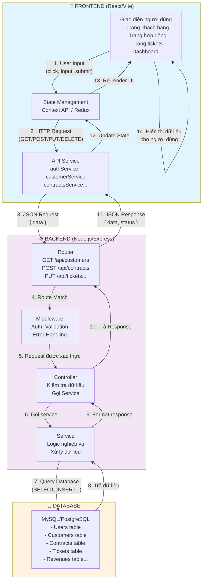

# 3.4 THIẾT KẾ KIẾN TRÚC HỆ THỐNG

## 3.4.1 Mô tả lý thuyết kiến trúc tổng thể

### Tổng quan

Hệ thống CRM được thiết kế theo mô hình kiến trúc **ba lớp (Three-Tier Architecture)** với sự tách biệt rõ ràng giữa tầng giao diện người dùng, tầng xử lý logic nghiệp vụ, và tầng dữ liệu. Kiến trúc này đảm bảo tính độc lập, dễ bảo trì, mở rộng và khả năng tái sử dụng cao.

Hệ thống bao gồm 4 thành phần chính tương tác với nhau theo luồng FE ↔ API ↔ BE ↔ DB:

### Thành phần kiến trúc

#### 1. **Tầng Giao diện (Frontend - FE)**

**Định nghĩa:** Là tầng trình bày (Presentation Layer), được xây dựng bằng React và Vite, chạy trên trình duyệt web của người dùng cuối.

**Chức năng:**
- Cung cấp giao diện người dùng trực quan cho các nhân viên quản lý khách hàng, hợp đồng, doanh thu, tickets và các chức năng khác
- Hiển thị dữ liệu từ server dưới dạng bảng, biểu đồ, form nhập liệu
- Xử lý các sự kiện từ người dùng (click, input, submit, search...)
- Gửi yêu cầu HTTP (GET, POST, PUT, DELETE) tới backend thông qua các API service
- Lưu trữ trạng thái ứng dụng thông qua Context API và Redux (state management)

**Công nghệ:** React.js, Vite, Tailwind CSS, Axios

#### 2. **Tầng API (Application Programming Interface)**

**Định nghĩa:** Là lớp trung gian để giao tiếp giữa Frontend và Backend, định nghĩa các endpoint và quy ước giao tiếp thông qua HTTP.

**Chức năng:**
- Định nghĩa các route endpoint mà Frontend gọi, ví dụ:
  - `/api/auth/login` - Đăng nhập
  - `/api/customers` - Quản lý khách hàng
  - `/api/contracts` - Quản lý hợp đồng
  - `/api/tickets` - Quản lý tickets hỗ trợ
  - `/api/dashboard` - Lấy dữ liệu dashboard
  - v.v.
- Yêu cầu và xác thực dữ liệu từ Frontend
- Trả về dữ liệu dưới định dạng JSON

**Đặc điểm:** RESTful API, HTTP-based communication, JSON format

#### 3. **Tầng Xử lý Nghiệp vụ (Backend - BE)**

**Định nghĩa:** Là tầng ứng dụng (Application Layer), được xây dựng bằng Node.js và Express, chạy trên server phía máy chủ.

**Chức năng:**
- Tiếp nhận request từ Frontend thông qua các API endpoint
- Xác thực và phân quyền người dùng (Authentication & Authorization)
- Xử lý các quy tắc nghiệp vụ phức tạp:
  - Quản lý khách hàng: thêm, sửa, xóa, tìm kiếm khách hàng
  - Quản lý hợp đồng: tạo, theo dõi, cập nhật trạng thái hợp đồng
  - Quản lý tickets: tạo, phân công, theo dõi tiến độ xử lý
  - Quản lý doanh thu: tính toán, báo cáo, biểu đồ
  - Upload file: quản lý file, lưu trữ trên Cloudinary
  - Gửi thông báo cho người dùng
  - Tạo báo cáo và dashboard thống kê
- Tương tác với cơ sở dữ liệu để lưu/lấy dữ liệu
- Trả về response dưới dạng JSON

**Kiến trúc Module:** Backend được chia thành các module độc lập, mỗi module xử lý một chức năng cụ thể:
- `auth/` - Xác thực người dùng
- `customers/` - Quản lý khách hàng
- `contracts/` - Quản lý hợp đồng
- `tickets/` - Quản lý tickets hỗ trợ
- `revenues/` - Quản lý và báo cáo doanh thu
- `notifications/` - Hệ thống thông báo
- `solutions/` - Quản lý giải pháp
- `users/` - Quản lý người dùng
- `upload/` - Quản lý upload file
- `dashboard/` - Lấy dữ liệu dashboard

**Cấu trúc của mỗi module:**
- **Routes:** Định nghĩa các endpoint và gắn middleware, controller
- **Controller:** Tiếp nhận request, kiểm tra dữ liệu đầu vào, gọi service, trả về response
- **Service:** Chứa logic nghiệp vụ, tương tác với database, xử lý dữ liệu

**Công nghệ:** Node.js, Express.js, Middleware xác thực

#### 4. **Tầng Dữ liệu (Database - DB)**

**Định nghĩa:** Là tầng lưu trữ (Data Layer), chứa dữ liệu của toàn bộ hệ thống.

**Chức năng:**
- Lưu trữ dữ liệu có cấu trúc:
  - Thông tin người dùng (username, password, role, quyền...)
  - Thông tin khách hàng (tên, điện thoại, email, địa chỉ...)
  - Thông tin hợp đồng (số hiệu, ngày ký, giá trị, trạng thái...)
  - Thông tin tickets (tiêu đề, nội dung, trạng thái, người xử lý...)
  - Thông tin doanh thu (date, amount, category...)
  - Thông tin thông báo, tài liệu, đính kèm...
- Cung cấp cơ chế query, insert, update, delete dữ liệu
- Đảm bảo tính toàn vẹn dữ liệu (Data Integrity)
- Cung cấp backup, phục hồi dữ liệu (Data Recovery)

**Công nghệ:** MySQL/PostgreSQL hoặc MongoDB, được kết nối qua `backend/config/database.js`

## 3.4.2 Luồng dữ liệu (Data Flow)

Khi người dùng tương tác với hệ thống, dữ liệu chảy theo các bước sau:

1. **Input từ người dùng (User Input):** 
   - Người dùng nhập dữ liệu vào form hoặc thực hiện hành động trên Frontend (ví dụ: click button "Tạo khách hàng mới")

2. **Gửi yêu cầu (Request):**
   - Frontend gửi HTTP request tới API endpoint trên Backend (ví dụ: POST /api/customers với dữ liệu khách hàng)
   - Dữ liệu được gửi dưới dạng JSON

3. **Xử lý trên Backend:**
   - Backend nhận request thông qua Router
   - Router chuyển request tới Controller tương ứng
   - Controller kiểm tra dữ liệu, xác thực (middleware auth)
   - Controller gọi Service để xử lý logic nghiệp vụ
   - Service thực hiện các thao tác với Database (INSERT, UPDATE, SELECT, DELETE)

4. **Tương tác với Database:**
   - Service gửi query tới Database
   - Database xử lý và trả về dữ liệu hoặc xác nhận thao tác

5. **Trả kết quả về Backend:**
   - Service nhận dữ liệu từ Database
   - Service xử lý, format dữ liệu nếu cần
   - Service trả kết quả về Controller

6. **Gửi Response về Frontend:**
   - Controller chuẩn bị Response (thành công hoặc lỗi)
   - Backend gửi HTTP Response (status code + JSON data) về Frontend

7. **Cập nhật Giao diện:**
   - Frontend nhận Response
   - Cập nhật state của ứng dụng (thông qua useState, Redux...)
   - Re-render giao diện để hiển thị dữ liệu mới

## 3.4.3 Sơ đồ kiến trúc tổng thể (FE ↔ API ↔ BE ↔ DB)

**Cách đọc sơ đồ:**
- Mũi tên từ trên xuống minh họa luồng dữ liệu khi người dùng thực hiện hành động
- **Frontend:** Xử lý giao diện, gửi request tới backend
- **Backend:** Xử lý logic nghiệp vụ, tương tác với database
- **Database:** Lưu trữ và trả dữ liệu

## 3.4.4 Lợi ích của kiến trúc này

| Lợi ích | Giải thích |
|---------|-----------|
| **Tách biệt trách nhiệm** | Mỗi tầng có chức năng riêng, dễ dàng phát triển, kiểm tra độc lập |
| **Dễ bảo trì** | Lỗi ở tầng này không ảnh hưởng tầng khác; dễ fix bug |
| **Khả năng mở rộng** | Có thể thêm module mới mà không cần thay đổi toàn bộ hệ thống |
| **Tái sử dụng mã** | Module, service, controller có thể tái sử dụng cho nhiều endpoint khác |
| **Hiệu suất cao** | Frontend chỉ render khi có dữ liệu mới; Backend xử lý song song nhiều request |
| **Bảo mật tốt** | Xác thực, phân quyền tập trung ở Backend; dữ liệu nhạy cảm không lộ ra Frontend |

## 3.4.5 Công nghệ sử dụng

- **Frontend:** React.js, Vite, Tailwind CSS, Axios
- **Backend:** Node.js, Express.js, Middleware (auth, validation, error handling)
- **Database:** MySQL hoặc PostgreSQL
- **File Storage:** Cloudinary (upload file)
- **Giao tiếp:** HTTP/HTTPS, REST API, JSON

---

## 3.4.6 Luồng xác thực (Authentication Flow: Login → JWT → Refresh)

### Giới thiệu

Hệ thống sử dụng **JWT (JSON Web Token)** để xác thực người dùng. JWT là một chuỗi mã hóa chứa thông tin về người dùng, có hạn sử dụng và không cần truy vấn database mỗi lần.

**Thành phần chính:**
- **Access Token (Token chính):** Token ngắn hạn (15-30 phút), dùng để xác thực các request thông thường
- **Refresh Token (Token làm mới):** Token dài hạn (7-30 ngày), dùng để lấy Access Token mới khi hết hạn
- **Session Storage:** Lưu token trên trình duyệt (localStorage hoặc sessionStorage)

### Quy trình xác thực chi tiết

#### **Bước 1: Đăng nhập (Login)**
1. Người dùng nhập username/email và password vào form đăng nhập
2. Frontend gửi POST request tới `/api/auth/login` với dữ liệu: `{ email, password }`
3. Backend kiểm tra email và password trong database
4. Nếu đúng:
   - Backend tạo **Access Token** (hạn 15-30 phút) và **Refresh Token** (hạn 7 ngày)
   - Trả về Response: `{ accessToken, refreshToken, user: { id, name, role... } }`
   - Refresh Token được lưu trong database (để có thể revoke nếu cần)
5. Nếu sai: Trả về lỗi 401 Unauthorized

#### **Bước 2: Sử dụng Access Token**
1. Frontend lưu Access Token và Refresh Token vào localStorage
2. Khi gửi request bình thường (GET, POST...), Frontend thêm Access Token vào HTTP header: `Authorization: Bearer <accessToken>`
3. Backend middleware kiểm tra và xác thực token
4. Nếu token hợp lệ: cho phép request tiếp tục
5. Nếu token hết hạn: Backend trả về 401 (Token Expired)

#### **Bước 3: Làm mới Token (Refresh Token)**
1. Khi Access Token hết hạn, Frontend tự động gửi POST request tới `/api/auth/refresh` với Refresh Token
2. Backend kiểm tra Refresh Token:
   - Kiểm tra token có hợp lệ, chưa hết hạn không
   - Kiểm tra token có tồn tại trong database không (để đảm bảo chưa bị revoke)
3. Nếu hợp lệ: Tạo Access Token mới, trả về: `{ accessToken }`
4. Nếu hết hạn hoặc không hợp lệ: Yêu cầu người dùng đăng nhập lại
5. Frontend cập nhật Access Token mới trong localStorage

#### **Bước 4: Đăng xuất (Logout)**
1. Người dùng click nút "Đăng xuất"
2. Frontend gửi POST request tới `/api/auth/logout` (có kèm token)
3. Backend xóa Refresh Token khỏi database (để revoke)
4. Frontend xóa Access Token và Refresh Token khỏi localStorage
5. Chuyển hướng về trang đăng nhập

### Sơ đồ luồng xác thực (Login → JWT → Refresh)

```mermaid
sequenceDiagram
    participant User as 👤 User
    participant Frontend as 🖥️ Frontend
    participant Backend as ⚙️ Backend
    participant Database as 💾 Database

    User->>Frontend: 1️⃣ Nhập email & password<br/>Click "Đăng nhập"
    
    Frontend->>Backend: 2️⃣ POST /api/auth/login<br/>{ email, password }
    
    Backend->>Database: 3️⃣ Tìm user theo email
    Database-->>Backend: User data
    
    alt ✅ Email & Password đúng
        Backend->>Backend: 4️⃣ Tạo Access Token<br/>(15-30 phút)
        Backend->>Backend: Tạo Refresh Token<br/>(7 ngày)
        Backend->>Database: 5️⃣ Lưu Refresh Token<br/>vào database
        Backend-->>Frontend: 6️⃣ Response 200 OK<br/>{ accessToken,<br/>refreshToken, user }
        
        Frontend->>Frontend: 7️⃣ Lưu token<br/>vào localStorage<br/>Access Token:<br/>localStorage.token<br/>Refresh Token:<br/>localStorage.refreshToken
        Frontend-->>User: ✅ Đăng nhập thành công<br/>Chuyển tới Dashboard
        
    else ❌ Email hoặc Password sai
        Backend-->>Frontend: Response 401<br/>{ message: "Invalid credentials" }
        Frontend-->>User: ❌ Lỗi: Email hoặc password<br/>không chính xác
    end

    rect rgb(200, 240, 255)
    Note over User,Database: 📌 Sử dụng Access Token cho các request thường xuyên
    User->>Frontend: 8️⃣ Tương tác: Xem danh sách<br/>khách hàng
    Frontend->>Backend: 9️⃣ GET /api/customers<br/>Header: Authorization:<br/>Bearer <accessToken>
    Backend->>Backend: 🔍 Verify Access Token
    
    alt ✅ Token hợp lệ & chưa hết hạn
        Backend->>Database: Truy vấn dữ liệu
        Database-->>Backend: Customer data
        Backend-->>Frontend: ✅ Response 200 OK<br/>{ customers: [...] }
        Frontend-->>User: Hiển thị danh sách<br/>khách hàng
        
    else ❌ Token hết hạn
        Backend-->>Frontend: Response 401<br/>{ message: "Token expired" }
        Frontend->>Frontend: Token hết hạn,<br/>trigger refresh
    end
    end

    rect rgb(255, 240, 200)
    Note over User,Database: 🔄 Làm mới Access Token (Refresh Flow)
    Frontend->>Backend: 🔟 POST /api/auth/refresh<br/>{ refreshToken }
    Backend->>Database: ⓫ Kiểm tra Refresh Token<br/>trong database
    
    alt ✅ Refresh Token hợp lệ & chưa hết hạn
        Database-->>Backend: Token found & valid
        Backend->>Backend: ⓬ Tạo Access Token mới<br/>(15-30 phút)
        Backend-->>Frontend: Response 200 OK<br/>{ accessToken: new_token }
        Frontend->>Frontend: ⓭ Cập nhật token mới<br/>localStorage.token = new_token
        Frontend->>Backend: Retry request cũ<br/>với token mới
        Backend-->>Frontend: ✅ Request thành công
        
    else ❌ Refresh Token hết hạn hoặc không tìm thấy
        Database-->>Backend: Token not found or expired
        Backend-->>Frontend: Response 401<br/>{ message: "Refresh token invalid" }
        Frontend-->>User: ⓮ Yêu cầu đăng nhập lại
        Frontend->>Frontend: Xóa tất cả token<br/>Redirect → Login page
    end
    end

    rect rgb(240, 200, 255)
    Note over User,Database: 🚪 Đăng xuất (Logout)
    User->>Frontend: ⓯ Click "Đăng xuất"
    Frontend->>Backend: ⓰ POST /api/auth/logout<br/>{ refreshToken }
    Backend->>Database: ⓱ Xóa Refresh Token<br/>khỏi database
    Database-->>Backend: Deleted
    Backend-->>Frontend: Response 200 OK
    Frontend->>Frontend: ⓲ Xóa tokens khỏi<br/>localStorage
    Frontend-->>User: ✅ Đã đăng xuất<br/>Redirect → Login page
    end
```

### Bảng so sánh Access Token vs Refresh Token

| Tiêu chí | Access Token | Refresh Token |
|---------|-------------|--------------|
| **Hạn sử dụng** | Ngắn (15-30 phút) | Dài (7-30 ngày) |
| **Mục đích** | Xác thực các request thường xuyên | Tạo Access Token mới |
| **Gửi ở đâu** | Header `Authorization: Bearer <token>` | Body của request `/api/auth/refresh` |
| **Lưu trữ** | localStorage (không nhạy cảm lắm) | localStorage + Database |
| **Nếu bị lộ** | Thiệt hại hạn chế (hết hạn nhanh) | Cần revoke ngay (xóa khỏi DB) |
| **Revoke** | Khó, phải check blacklist | Dễ, xóa khỏi DB |

### Các trường hợp đặc biệt

1. **User thay đổi mật khẩu:** Tất cả Refresh Token được xóa, user phải đăng nhập lại
2. **User bị khóa tài khoản:** Refresh Token bị xóa khỏi DB, không thể lấy Access Token mới
3. **Logout từ tất cả thiết bị:** Xóa tất cả Refresh Token của user trong DB
4. **Token bị đánh cắp:** 
   - Access Token hạn chế thiệt hại vì hết hạn nhanh
   - Refresh Token nên được bảo vệ bằng httpOnly cookie hoặc sẵn sàng revoke nhanh

### Lợi ích của JWT Authentication

| Lợi ích | Giải thích |
|---------|-----------|
| **Stateless** | Backend không cần lưu session, giảm tải server |
| **Scalable** | Có thể phân tán trên nhiều server mà không cần đồng bộ session |
| **Bảo mật** | Token được ký và mã hóa, khó giả mạo |
| **Tái sử dụng** | Token có thể sử dụng cho nhiều service khác nhau (microservice) |
| **Hiệu suất** | Không cần truy vấn DB mỗi request (chỉ check chữ ký) |

